# Inventory Database System

> 🎯 **Portfolio Project** — Built to demonstrate database design, SQL proficiency, and problem-solving skills for job applications.

<p align="center">
  
  
</p>

---

## 📊 ER Diagram



## 📝 Description

A robust, production-ready **Inventory Database System** built with PostgreSQL. Features a normalized 3NF relational schema with 11 tables, stored procedures for business logic, analytical queries for reporting, and comprehensive test data. Ideal for small-to-medium inventory management operations and demonstrating SQL proficiency for technical roles.

---

## 🛠️ Tech Stack

| Category           | Technology               |
| ------------------ | ------------------------ |
| **Database**       | PostgreSQL 14+           |
| **Query Language** | SQL (PostgreSQL dialect) |
| **Tools**          | pgAdmin, DBeaver, psql   |

---

## ✨ Features

- ✅ Designed relational schema with multiple tables and relationships (primary/foreign keys)
- ✅ Wrote SQL queries with JOINs and aggregates to retrieve/analyze data
- ✅ Implemented CRUD operations and basic stored procedures
- ✅ Prepared test cases, executed manual tests, and resolved defects via root cause analysis

---

## 🗂️ Database Schema

The system consists of **11 tables** following Third Normal Form (3NF):

| #   | Table                  | Purpose                                        |
| --- | ---------------------- | ---------------------------------------------- |
| 1   | `categories`           | Product category classification                |
| 2   | `suppliers`            | Vendor/supplier information                    |
| 3   | `warehouses`           | Storage locations                              |
| 4   | `products`             | Master product catalog                         |
| 5   | `inventory`            | Current stock levels per product per warehouse |
| 6   | `customers`            | Customer records                               |
| 7   | `purchase_orders`      | Purchase order header                          |
| 8   | `purchase_order_items` | Purchase order line items                      |
| 9   | `sales_orders`         | Sales order header                             |
| 10  | `sales_order_items`    | Sales order line items                         |
| 11  | `stock_transactions`   | Audit log for all stock movements              |

---

## 📁 Files Structure

```

Inventory_Database_System_2025/
├── README.md # Project documentation
├── schema.sql # Database schema (DDL)
├── sample_data.sql # Sample test data
├── procedures.sql # Stored procedures
└── analytical_queries.sql # Analytical/reporting queries

```

---

## 🚀 Setup Instructions

### Step 1: Install PostgreSQL

1. Download PostgreSQL from [postgresql.org](https://www.postgresql.org/download/)
2. Install with default settings (port: `5432`)
3. Set a password for the `postgres` superuser

### Step 2: Create Database

Open pgAdmin or psql and run:

```sql
CREATE DATABASE inventory_db;
```

Or via command line:

```bash
psql -U postgres -c "CREATE DATABASE inventory_db;"
```

### Step 3: Run SQL Files

Execute the files in the following order:

```bash
# 1. Schema (creates tables)
psql -U postgres -d inventory_db -f schema.sql

# 2. Sample Data (inserts test data)
psql -U postgres -d inventory_db -f sample_data.sql

# 3. Stored Procedures
psql -U postgres -d inventory_db -f procedures.sql

# 4. Analytical Queries (view-only, run as needed)
psql -U postgres -d inventory_db -f analytical_queries.sql
```

> **Tip:** In pgAdmin, right-click your database → _Restore_ → select each `.sql` file.

---

## 💡 How to Use

### Running Stored Procedures

```sql
-- Add a new product
SELECT add_new_product(
    'Wireless Mouse',      -- product_name
    'WM-001',              -- sku
    1,                     -- category_id
    1,                     -- supplier_id
    25.99,                 -- unit_price
    10,                    -- reorder_level
    'Ergonomic wireless mouse'  -- description
);

-- Record a purchase (add stock)
SELECT record_purchase(
    1,    -- product_id
    1,    -- warehouse_id
    50,   -- quantity
    1     -- supplier_id
);

-- Record a sale (decreases stock)
SELECT record_sale(
    1,    -- product_id
    1,    -- warehouse_id
    5,    -- quantity
    1     -- customer_id
);

-- Manual stock adjustment
SELECT adjust_stock(
    1,    -- product_id
    1,    -- warehouse_id
    -3,   -- quantity_change (negative = decrease)
    'Damaged goods'  -- reason
);
```

### Running Analytical Queries

```sql
-- View all queries in analytical_queries.sql
-- Example: Low stock alert
SELECT * FROM low_stock_alert;  -- (run full query from file)
```

---

## 📊 Sample Queries

### 1. Current Total Inventory Value

```sql
SELECT
    SUM(i.quantity * p.unit_price) AS total_inventory_value
FROM inventory i
JOIN products p ON i.product_id = p.product_id;
```

**Output:**
| total_inventory_value |
|----------------------|
| 125,450.00 |

---

### 2. Top 5 Best-Selling Products

```sql
SELECT
    p.product_name,
    SUM(soi.quantity) AS total_sold,
    SUM(soi.subtotal) AS revenue
FROM products p
JOIN sales_order_items soi ON p.product_id = soi.product_id
GROUP BY p.product_name
ORDER BY total_sold DESC
LIMIT 5;
```

**Output:**
| product_name | total_sold | revenue |
|--------------|------------|---------|
| USB-C Cable | 150 | 2,250.00|
| Mouse Pad | 120 | 600.00 |
| Keyboard | 85 | 8,500.00|

---

### 3. Low Stock Alert

```sql
SELECT
    p.product_name,
    p.sku,
    p.reorder_level,
    COALESCE(SUM(i.quantity), 0) AS current_stock
FROM products p
LEFT JOIN inventory i ON p.product_id = i.product_id
GROUP BY p.product_id, p.product_name, p.sku, p.reorder_level
HAVING COALESCE(SUM(i.quantity), 0) < p.reorder_level;
```

**Output:**
| product_name | sku | reorder_level | current_stock |
|--------------|-----|---------------|---------------|
| HDMI Cable | HC-01 | 20 | 5 |

---

## 🔮 Future Enhancements

- [ ] Add triggers for automatic stock updates
- [ ] Implement user authentication and role-based access
- [ ] Add views for real-time dashboard
- [ ] Integrate with REST API (Node.js/Python)
- [ ] Add migration scripts for version control

---

## 📄 License

This project is licensed under the **MIT License**.

---

## 👤 Author

**Hemanth**

> Full Stack Developer | SQL Enthusiast | Open Source Contributor

---

<p align="center">⭐ Star this repo if you found it useful!</p>
